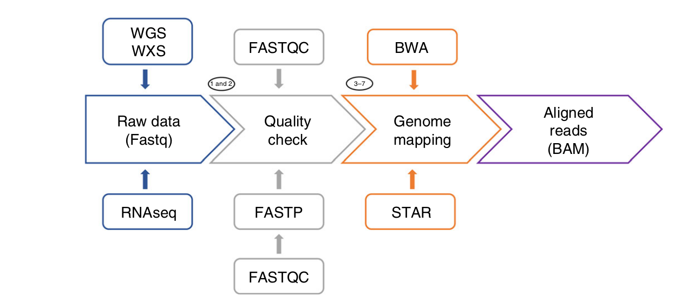
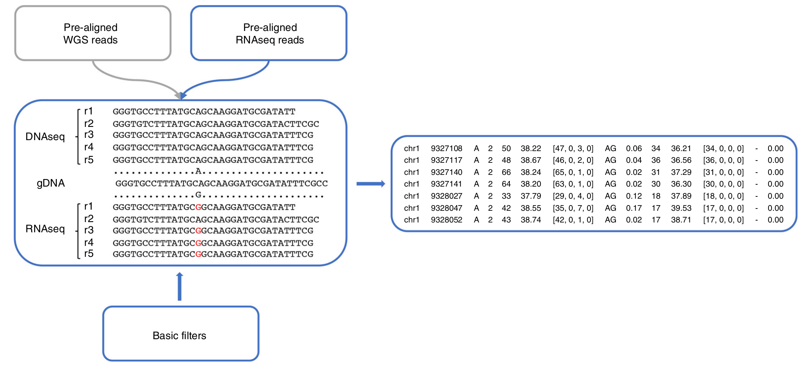
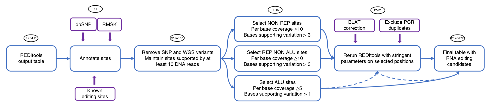

# Epitranscriptome Course Bari 28-April-2023

 Epitranscriptome refers to all biochemical RNA modifications affecting cellular RNAs. 
Nowadays, RNAseq is the de facto standard approach to discover RNA editing candidates in whole
eukaryotic.   Although the identification of editing sites is, in principle, quite simple, it
represents a computational challenge because true RNA editing events have to be discriminated from
genome-encoded single-nucleotide polymorphisms (SNPs) and technical artefacts caused by
sequencing or read-mapping errors. 
The use of genomic reads from whole genome sequencing (WGS) or whole exome sequencing (WXS) experiments in single individuals, 
annotations in the database of SNPs (dbSNP) and several stringent filters can minimize the detection of false RNA editing candidates.  
The entire procedure is <b<human specific</b> but can be applied to other organisms
with available transcriptomic and genomic reads.   
The detection of RNA editing is carried out by our
REDItools package, which is able to handle RNAseq data alone or combine RNAseq and genomic
reads from WGS or WXS experiments to reduce the false discovery rate due to SNPs. 
</img>
<ul>
<li>The main procedure begins with the download of RNAseq and WGS data in the standard fastq
format and the subsequent preprocessing to improve their global quality and ensure
that input raw data are not biased.</li> 
<li>To this aim, collected reads are inspected using
FASTQC (https://github.com/s-andrews/FastQC) to perform some quality control checks and cleaned
using FASTP to remove read regions of low quality or potential adaptor sequences or poly(A)-tails
(or long terminal homopolymeric stretches).</li>
<li>Next, cleaned reads are aligned onto the reference genom. While RNAseq reads
are mapped using STAR, an ultrafast splice-aware software, WGS reads are aligned using BWA,
which does not take into account the spliced nature of reads.</li>
<li>Finally, aligned
transcriptome and genome reads are converted in the standard BAM format using SAMtools.  
Unlike BWA, STAR parameters can be tuned to directly output reads in BAM format,
saving time and avoiding SAMtools calls.</li>
 
</img>
After the preprocessing, RNAseq and WGS reads are passed to the REDItoolDnaRna.py script
using non-stringent parameters to identify all potential DNA–RNA variants.  The use of
loosing parameters, defined as <b>basic filters</b>, is an expedient to <b>save computing time</b> in all
cases in which a user needs to run multiple instances of REDItools with different option values.</b></li>

At the end of the REDItoolDnaRna.py script run, all DNA–RNA variants are returned in a simple and tab-delimited table
and subjected to further filters according to the workflow depicted here: 
</img>
 
<ul>
  <li>Briefly, positions from the first REDItools round are annotated by means of the AnnotateTable.
py script using known SNP sites, repeated elements in RepeatMasker and editing events stored in our
REDIportal database.</li>
  <li>Then, SNPs (and sites not supported by ≥10 WGS reads) are removed, and the
remaining positions are divided according to RepeatMasker annotations in three groups: ALU, REP
NON ALU and NON REP.</li>
  <li>NON REP and REP NON ALU variants undergo a second round of REDItoolDnaRna.py
using more stringent call criteria than their counterparts in ALU regions.  
  <li> In addition, reads supporting variants are collected and mapped onto the reference genome using PBLAT, a faster version
  of the classical BLAT tool , to detect reads mapping on multiple genome locations with similar scores. </li> 
  <li> The same reads are also inspected to exclude PCR duplication. At the end, all filtered positions
are collected, returning the final list of RNA editing candidates.</li>
  </ul>
 

<a href="https://github.com/claudiologiudice/Elixir_training_course/blob/main/reditoolsdnarna2.md"> NEXT </a>

