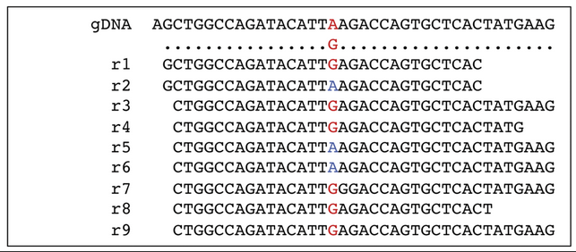

# Epitranscriptome Course Bari 28-April-2023 

 
The main steps described during the practice are reported below and can be easily copy/pasted in your terminal  
(please remove the <b>$</b> simbol during copy&paste. 
<b>Note.</b> Assuming you're student_X, please change X according to your workspace. 
<b>Note2.</b> Choose a GTEX sample from Cerebellum or Artery and copy RNAseq data accordingly from its path to your home folder. 
<b>IMPORTANT!</b> REDItoolDnaRna.py outTable (eg. outTable_892028847) contains 9digit random number, so it usually varies among users and different script launches on the same machine. 
  In case of errors or techincal problems <b>do not hesitate to stop the trainer(s).</b> 
  This practical part refers to the protocol <a href="https://www.nature.com/articles/s41596-019-0279-7">here available</a>:

<table>
<thead>
<th>Sample</th>
<th>Tissue</th>
<th>Gender</th>
<th>Path</th>
<tr>
<td>SRR1083076.bam</td>
<td>Artery - Aorta</td>
<td>male normal</td> 
<td>/data/artery/SRR1083076/SRR1083076.bam/</td>
</tr>
<tr>
<td>SRR1091254.bam</td>
<td>Artery - Aorta</td>
<td>male normal</td>
<td>/data/artery/SRR1091254/SRR1091254.bam</td>
</tr>
<tr>
<td>SRR1368668.bam</td>
<td>Artery - Aorta</td>
<td>male normal</td>
<td>/data/artery/SRR1368668/SRR1368668.bam</td>
</tr>
<tr>
<td>SRR1086680.bam</td>
<td>Brain - Cerebellum</td>
<td>male normal</td>
<td>/data/brain/SRR1086680/SRR1086680.bam</td>
</tr>
<tr>
<td>SRR1311771.bam</td>
<td>Brain - Cerebellum</td>
<td>male normal</td>
<td>/data/brain/SRR1311771/SRR1311771.bam</td>
</tr>
</tr>
<tr>
<!--td>SRR1319672.bam</td>
<td>Brain - Cerebellum</td>
<td>male normal</td>
<td>/data/brain/SRR1319672/SRR1319672.bam</td-->
</tr>  
</thead>
</table>

<pre>
<b>1) Create a folder for your RNAseq data (eg. RNAseq) in your home folder (eg. student_X)</b>
$ mkdir RNAseq

<b>2) Enter the folder and copy the Aligned RNAseq reads (BAM format) from /data to it</b>
$ cd RNAseq
$ cp /data/brain/SRRXXXXXXXX/SRRXXXXXXXX.bam* .
e.g (SRR1086680)

<b>3) Detect all potential RNA variants in your input BAM using the REDItoolDnaRNA.py script:</b>
$ python ../corso_epitrascrittomica/data_reditools/src/REDItools/main/REDItoolDnaRna.py -o /home/student_<b>X</b>/RNAseq -i SRRXXXXXXX.bam -f /data/annotations/GRCh37.primary_assembly.genome.fa -t 4 -c 0,1 -m 0,255 -v 1 -q 0,30 -e -n 0.0 -N 0.0 -u -l -p

e.g. python ../corso_epitrascrittomica/data_reditools/src/REDItools/main/REDItoolDnaRna.py -o /home/student_7/RNAseq -i /home/student_7/RNAseq/SRR1319672.bam -f /data/annotations/GRCh37.primary_assembly.genome.fa -t 4 -c 0,1 -m 0,255 -v 1 -q 0,30 -e -n 0.0 -N 0.0 -u -l -p

For detailed REDItoolDnaRna.py options <a href="https://github.com/BioinfoUNIBA/REDItools/blob/master/README_1.md#reditooldnarna-py">click here</a>

Note. Since we are not using WGS as input, REDItoolDnaRNA.py will work as REDItoolDenovo.py, another Reditools package  script that has been conceived to predict potential RNA editing events using <b>RNA-Seq data alone and without any a priori  knowledge about genome information</b>.

<b>4) Exclude invariant positions (RNAseq position showing no variations respect to the genome reference):</b>
$ awk 'FS="\t" {if ($8!="-") print}' DnaRna_XXXXXXX/outTable_XXXXXX > outTable_XXXXXX.out

where $8!="-" selects only variant positions (from column 8 of the output table)

</img>

<b>5) Annotate positions using RepeatMasker and dbSNP annotations:</b>

$ python ../corso_epitrascrittomica/data_reditools/src/REDItools/accessory/AnnotateTable.py -a /data/annotations/rmsk.sorted.gtf.gz -n rmsk -i outTable_XXXXXX.out -o outTable_XXXXXX.out.out.rmsk -u

$ python ../corso_epitrascrittomica/data_reditools/src/REDItools/accessory/AnnotateTable.py -a /data/annotations/snp151.sorted.gtf.gz -n snp151 -i outTable_XXXXXX.out.rmsk -o outTable_XXXXXX.out.rmsk.snp -u

For detailed AnnotateTable.py options <a href="https://github.com/BioinfoUNIBA/REDItools/blob/master/README_1.md#annotatetable-py">click here</a>

<b>6) Create a first set of positions selecting sites supported by at least five RNAseq reads and a single mismatch:</b>

$ python ../corso_epitrascrittomica/data_reditools/src/REDItools/accessory/selectPositions.py -i outTable_XXXXXX.out.rmsk.snp -c 5 -v 1 -f 0.0 -o outTable_XXXXXX.out.rmsk.snp.sel1

For detailed selectPositions.py options <a href="https://github.com/BioinfoUNIBA/REDItools/blob/master/README_1.md#selectpositions-py">click here</a>

<b>7) Create a second set of positions selecting sites supported by ≥10 RNAseq reads, three mismatches and minimum editing frequency of 0.1: </b>

$ python ../corso_epitrascrittomica/data_reditools/src/REDItools/accessory/selectPositions.py -i outTable_XXXXXX.out.rmsk.snp -c 10 -v 3 -f 0.1 -o outTable_XXXXXX.out.rmsk.snp.sel2

<b>8) Select ALU sites from the first set of positions:</b>

$ awk 'FS="\t" {if ($1!="chrM" && substr($16,1,3)=="Alu" && $17=="-" && $8!="-") print}' outTable_XXXXXX.out.rmsk.snp.sel1 > outTable_XXXXXX.out.rmsk.snp.alu

<b>9) Select REP NON ALU sites from the second set of positions, excluding sites in Simple repeats or Low complexity regions:</b>

$ awk 'FS="\t" {if ($1!="chrM" && substr($16,1,3)!="Alu" && $15!="-" && $15!="Simple_repeat" && $15!="Low_complexity" && $17=="-" && $8!="-" && $9>=0.1) print}' outTable_XXXXXX.out.rmsk.snp.sel2 > outTable_XXXXXX.out.rmsk.snp.nonalu

<b>10) Select NON REP sites from the second set of positions:</b>

$ awk 'FS="\t" {if ($1!="chrM" && substr($16,1,3)!="Alu" && $15=="-" && $17=="-" && $8!="-" && $9>=0.1) print}' outTable_XXXXXX.out.rmsk.snp.sel2 > outTable_XXXXXX.out.rmsk.snp.nonrep

<b>11) Annotate ALU, REP NON ALU and NON REP sites using known editing events from REDIportal:</b>

$ python ../corso_epitrascrittomica/data_reditools/src/REDItools/accessory/AnnotateTable.py -a /data/annotations/atlas.gtf.gz -n ed -k R -c 1 -i outTable_XXXXXX.out.rmsk.snp.alu -o outTable_XXXXXX.out.rmsk.snp.alu.ed -u

$ python ../corso_epitrascrittomica/data_reditools/src/REDItools/accessory/AnnotateTable.py -a /data/annotations/atlas.gtf.gz -n ed -k R -c 1 -i outTable_XXXXXX.out.rmsk.snp.nonalu -o outTable_XXXXXX.out.rmsk.snp.nonalu.ed -u

$ python ../corso_epitrascrittomica/data_reditools/src/REDItools/accessory/AnnotateTable.py -a /data/annotations/atlas.gtf.gz -n ed -k R -c 1 -i outTable_XXXXXX.out.rmsk.snp.nonrep -o outTable_XXXXXX.out.rmsk.snp.nonrep.ed -u

<b>12) Extract known editing events ($19=="ed" selects known RNA editing events) from ALU, REP NON ALU and NON REP sites:</b>

$ mv outTable_XXXXXX.out.rmsk.snp.alu.ed alu

$ mv outTable_XXXXXX.out.rmsk.snp.nonalu.ed nonalu

$ mv outTable_XXXXXX.out.rmsk.snp.nonrep.ed nonrep

$ cat alu nonalu nonrep > alu-nonalu-nonrep

$ awk 'FS="\t" {if ($19=="ed") print}' alu-nonalu-nonrep > knownEditing 

<b>13) Convert editing candidates ($19!="ed" selects novel RNA editing events.) in REP NON ALU and NON REP sites in GFF format for further filtering:</b>

$ cat nonalu nonrep > nonalu-nonrep

$ awk 'FS="\t" {if ($19!="ed") print}' nonalu-nonrep > pos.txt

$ python ../corso_epitrascrittomica/data_reditools/src/REDItools/accessory/TableToGFF.py -i pos.txt -s -t -o pos.gff

For detailed TableToGFF.py options <a href="https://github.com/BioinfoUNIBA/REDItools/blob/master/README_1.md#tabletogff-py-new-in-version-1-0-3">click here</a>

<b>14) Convert editing candidates in ALU sites in GFF format for further filtering:</b>

$ awk 'FS="\t" {if ($19!="ed") print}' alu > posalu.txt

$ python ../corso_epitrascrittomica/data_reditools/src/REDItools/accessory/TableToGFF.py -i posalu.txt -s -t -o posalu.gff

<b>15) Launch REDItoolDnaRna.py on ALU sites using stringent criteria to recover potential editing candidates:</b>

$ python ../corso_epitrascrittomica/data_reditools/src/REDItools/main/REDItoolDnaRna.py -s 2 -g 2 -S -t 4 -i SRRXXXXXXX.bam -f /data/annotations/GRCh37.primary_assembly.genome.fa -c 5,5 -q 30,30 -m 255,255 -O 5,5 -p -u -a 11-6 -l -v 1 -n 0.0 -e -T posalu.sorted.gff.gz -w /data/annotations/gencode.v30lift37.splicesites.txt -k /data/annotations/nochr -R -o firstalu

<b>16) Launch REDItoolDnaRna.py on REP NON ALU and NON REP sites using stringent criteria to recover RNAseq reads harboring reference mismatches:</b>

$ python ../corso_epitrascrittomica/data_reditools/src/REDItools/main/REDItoolDnaRna.py -s 2 -g 2 -S -t 4 -i SRRXXXXXXX.bam -f /data/annotations/GRCh37.primary_assembly.genome.fa -c 10,10 -q 30,30 -m 255,255 -O 5,5 -p -u -a 11-6 -l -v 3 -n 0.1 -e -T pos.sorted.gff.gz -w /data/annotations/gencode.v30lift37.splicesites.txt -k /data/annotations/nochr --reads -R --addP -o first

<b>17) Launch pblat on RNAseq reads harboring reference mismatches from previous step and select multimapping reads:</b>

$ pblat -t=dna -q=rna -stepSize=5 -repMatch=2253 -minScore=20 -minIdentity=0 /data/annotations/GRCh37.primary_assembly.genome.fa first/DnaRna_506544611/outReads_506544611 reads.psl

$ ../corso_epitrascrittomica/data_reditools/src/REDItools/accessory/readPsl.py reads.psl badreads.txt

<b>18) Extract RNAseq reads harboring reference mismatches from Step 17 and remove duplicates:</b>
  
$ sort -k1,1 -k2,2n -k3,3n first/DnaRna_XXXXXXX/outPosReads_XXXXXX | mergeBed > bed

$ samtools view -h -@ 4 -L bed  -b SRRXXXXXXX.bam > SRRXXXXXXX_bed.bam

$ samtools sort -@ 4 -n SRRXXXXXXX_bed.bam -o SRRXXXXXXX_bed_ns.bam 

$ samtools fixmate -@ 4 -m SRRXXXXXXX_bed_ns.bam SRRXXXXXXX_bed_ns_fx.bam

$ samtools sort -@ 4 SRRXXXXXXX_bed_ns_fx.bam -o SRRXXXXXXX_bed_ns_fx.bam_st.bam

$ samtools markdup -r -@ 4 SRRXXXXXXX_bed_ns_fx.bam_st.bam SRRXXXXXXX_bed_dedup.bam

$ samtools index SRRXXXXXXX_bed_dedup.bam

<b>19) Re-run REDItoolDnaRna.py on REP NON ALU and NON REP sites using stringent criteria, deduplicated reads and mis-mapping info:</b>

$ python ../corso_epitrascrittomica/data_reditools/src/REDItools/main/REDItoolDnaRna.py -s 2 -g 2 -S -t 4 -i SRRXXXXXXX_bed_dedup.bam -f /data/annotations/GRCh37.primary_assembly.genome.fa -c 10,10 -q 30,30 -m 255,255 -O 5,5 -p -u -a 11-6 -l -v 3 -n 0.1 -e -T pos.sorted.gff.gz -w /data/annotations/gencode.v30lift37.splicesites.txt -R -k /data/annotations/nochr -b badreads.txt --rmIndels -o second
  
<b>20) Collect filtered ALU, REP NON ALU and NON REP sites:</b>

$ python ../corso_epitrascrittomica/data_reditools/src/REDItools/NPscripts/collect_editing_candidates.py 

$ sort -k1,1 -k2,2n editing.txt > editing_sorted.txt

Note. awk 'FS="\t" {if (($19=="ed") && ($8=="AG"||$8=="TC")) print}' editing_sorted.txt 
Note2. awk 'FS="\t" {if (($19!="ed") && ($8=="AG"||$8=="TC")) print}' editing_sorted.txt 

<b>21) Inspect the distribution of editing candidates to look at A-to-I enrichment: </b>

$ python ../corso_epitrascrittomica/data_reditools/src/REDItools/NPscripts/get_Statistics.py
  
